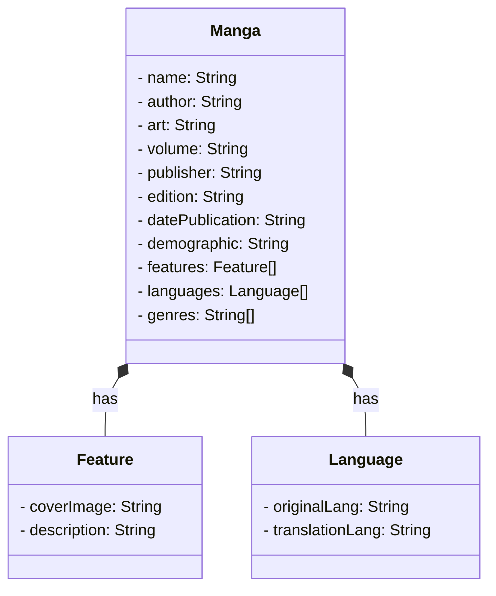

# Projeto de APIRestful para registrar coleção de mangá

Esse projeto foi criado durante o Santander Bootcamp 2023 - FullStack Angular + Java.

### Diagrama de Classes

Neste diagrama de classes, temos três classes principais: Manga, Feature e Language.

A classe Manga representa a obra de mangá em si, com os atributos a serem fornecidos, como nome, autor, artista, volume, editora, edição, data de publicação, gênero demográfico, características, idiomas e gêneros.
A classe Feature representa as características do mangá, incluindo a URL da imagem da capa e a descrição/sinopse.
A classe Language representa os idiomas em que o mangá foi publicado, incluindo o idioma original e o idioma da versão.
As relações indicam que a classe Manga possui associações com as classes Feature e Language, representando que um mangá pode ter várias características e idiomas associados a ele.
